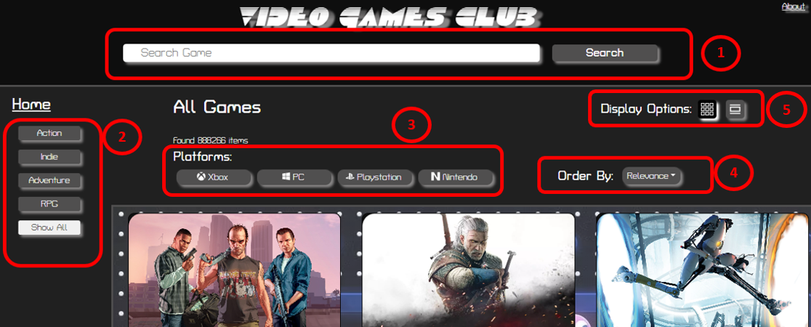

# About this Site Web

This site was created as a hobby and personal use. It is intended for all people who are passionate about video games. It's fully responsive so you can navigate trough it from almost any device.

On the site you can search for your favorite games and have information about them.

The site allows you to search by entering keywords, by platforms (Xbox, PC, Nintendo and Playstation), and also by genres (you can select from more than 20 genres!). You can also sort the search results according to your preferences (Relevance, Name, Released Date, Popularity, Average Rating).

**Website:** [Project Website](https://video-game-club.netlify.app/)  

## Technologies
This site was built using React JS. Además se utilizó JSX, HTML, CSS, Bootstrap y Axios.
All data is pulled from the [RAWG Video Games Database API](https://rawg.io/apidocs) using Axios.

## Site Description

### Home Page

`1` On the home page you can use the search bar to search for any game by its name.

`2` `3` You can also use the gender and platform filters for a more refined search. (First select the filters and then click on the search button).

`4` You can sort the results according to your preference (Relevance, Name, Released Date, Popularity, Average Rating).

`5` You can choose the display of results between grid and full mode.

### Game Page

Clicking on a game card you access the page with more detailed information.
You can find information about the release date, average playing time, platforms, ESRB rating, Developers,
genres and screenshots.

### About Page

Here you will find information about the site, the technologies used to develop it, as well as information about the developer and a contact form.
